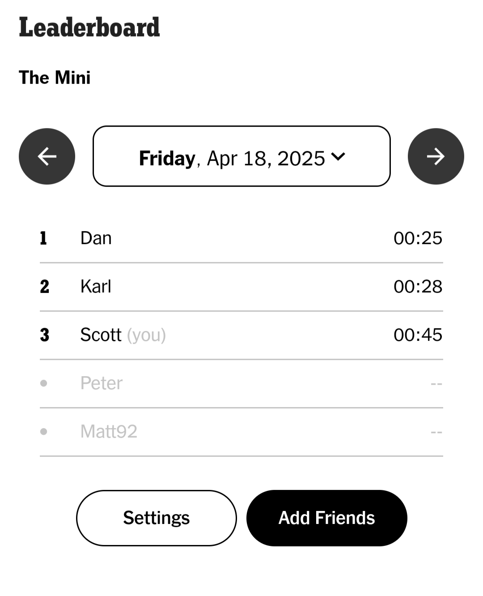

# Motivation

Last year, a friend of mine introduced me to the New York Times Mini Crossword. The Mini is a daily puzzle where players attempt to solve a small crossword (usually 4x4ish) as fast as possible.

{width="60%" fig-align="center"}

Within the NYT Games app there is a leaderboard where you can review your friends’ times for the day. Checking in each day, it's become quite clear to me that I am much worse than my friends. My leaderboard usually looks like this:

{width="60%" fig-align="center"}

I lose to Dan and Karl almost every day and I’m rarely within 15 seconds of their times. As I've continued to compete (and lose), I've found myself wondering if I'm improving at all. There aren't any historical performance metrics/ratings in the app, and I imagine it's because there are several aspects of The Mini that make it difficult to evaluate player performance:

-   **Puzzle difficulty varies each day.** The puzzles usually take Dan and Karl about 30 seconds to complete, while I finish in about 60 seconds. The fastest time I’ve observed is 12 seconds, while the slowest is over 2 minutes.
-   **Players don’t compete every day.** Dan, Karl, and I play almost every day, but we all miss days occasionally. Matt and Peter play too, but much less frequently. With a wide variance in puzzle difficulty, the puzzles players randomly choose to play could impact their average time.
-   **Each player’s skill is dynamic.** I think it’s a reasonable assumption that players change over time, so it wouldn’t make sense to model their skill as a stationary process.

In this post, I'll outline a model that could be used to evaluate crossword player performance (borrowing heavily from [this excellent post](http://richjand.rbind.io/post/2021/08/23/state-space-season-simulations/) by Richard Anderson)

# Simulating Crossword Times
I'll start by creating a simulation that generates fake crossword times. With a simulation, I can explicitly specify my hidden parameters of interest (player skill and puzzle difficulty) and test that my model is able to return the specified values. I'll need to make some assumptions on the data generation process, but I'll define it as:

$$y_{i,t} \sim N(\mu_{i,t} + \rho_{t} + \alpha, \sigma_{obs})$$
$$\mu_{i,t} \sim N(\mu_{i,t-1}, \sigma_{proc})$$

Per my definition, the observed crossword time, $y$, for player $i$ on day $t$ is a function of the player's skill, $\mu$, the puzzle difficulty, $\rho$, and a global intercept, $\alpha$. The crossword times are also subject to observation noise $\sigma_{obs}$. A player's skill on day $t$ is a function of their skill from the previous day with some process noise $\sigma_{proc}$.

The first step is to initialize the parameters for the simulation.
```{r}
#| output: false
library(dplyr)
library(ggplot2)
```

```{r}
#Simulation parameters
set.seed(5)

n_players <- 9
n_days <- 60

#Average puzzle time
global_mean <- 60

#Player skill distribution
skill_mean <- 0
skill_sd <- 10
skill_delta_sd <- 3

#Puzzle difficulty distribution
puzzle_mean <- 0
puzzle_sd <- 20

#Observation noise
noise_sd <- 10

#Fastest possible time
floor_time <- 10

#Plot variables
latent_skill_color <- "#d95f02"
plot_line_width <- 1
plot_text_size <- 15
plot_theme <- theme(text = element_text(size = plot_text_size)) 


```

Next, I'll simulate how player skill evolves for each of the 9 players over the course of the 60 days. To clarify, this is *latent* player skill, meaning we can't observe it directly. For this simulation, each player's skill follows a Gaussian random walk.

```{r}
player_skill <- data.frame("player_id" = integer(),
                           "day" = integer(),
                           "skill" = numeric())

for (i in 1:n_players) {
  skill <- rnorm(n = 1, mean = skill_mean, sd = skill_sd)
  skill_log <- c(skill)
  for (j in 2:n_days) {
    new_skill <- skill + rnorm(n = 1, mean = 0, sd = skill_delta_sd)
    skill_log <- c(skill_log,new_skill)
    skill <- new_skill
  }
  player_i_skill <- data.frame("player_id" = rep(i,n_days),
                               "day" = 1:n_days,
                               "skill"=skill_log)
  player_skill <- player_skill %>% 
    bind_rows(player_i_skill)
}

player_skill <- player_skill %>% 
  mutate(player_label = paste0("Player ",player_id)) %>% 
  relocate(player_label, .after = player_id)

player_skill %>% 
  ggplot(mapping = aes(x = day,
                       y = skill)) +
  geom_line(color = latent_skill_color,
            linewidth = plot_line_width) +
  facet_wrap(vars(player_label)) +
  labs(x = "Day",
       y = "Latent Skill",
       title = "Latent Player Skill by Day") +
  plot_theme

```

Now I need to simulate the puzzle difficulty for each day. This is straightforward - just random samples from a normal distribution with the specified parameters.

```{r}
puzzles <- data.frame("day"=1:n_days,
                      "difficulty" = rnorm(n = n_days, 
                                           mean = puzzle_mean, 
                                           sd = puzzle_sd))

```

Finally, I'll simulate the puzzle times by combining player skill, puzzle difficulty, and random observation noise.

```{r}
puzzle_results <- player_skill %>% 
  inner_join(puzzles, by = "day") %>% 
  mutate(noise = rnorm(n = n(), mean = 0, sd = noise_sd)) %>% 
  mutate(solve_time = global_mean + skill + difficulty + noise) %>% 
  mutate(solve_time = round(solve_time))

puzzle_results %>% 
  head()

```

```{r}
puzzle_results %>% 
  ggplot(mapping = aes(x = solve_time)) +
  geom_histogram(binwidth = 10) +
  geom_vline(xintercept = floor_time) +
  labs(x = "Solution Time",
       y = "Count",
       title = "Simulated Crossword Times") +
  plot_theme

```

I tailored the parameters of the simulation to reflect my best guess at the distribution of observed crossword times. Ideally, I'd like to compare this distribution to the actual, but I have not scraped the leaderboard within the NYT Games app. I'm hoping to include actual crossword times in a future post. 

I think it's unlikely that someone could complete the Mini in under 10 seconds, and obviously no one can solve the puzzle with a negative time. For now, I'll simply remove any times under 10 seconds, though there is probably a more elegant solution. My approach could introduce bias in the best players' skill estimates, but I'm not overly concerned with only a small handful of observations removed.

```{r}
puzzle_results %>% 
  filter(solve_time < floor_time) %>% 
  group_by(player_id) %>% 
  summarize(days = n())
```

Lastly, I'll sample a subset of the simulated data to reflect the actual environment, where players do not play every day.

```{r}
puzzle_results_obs <- puzzle_results %>% 
  filter(solve_time >= floor_time) %>% 
  group_by(player_id) %>% 
  sample_frac(0.6) %>% 
  as.data.frame()

puzzle_results_obs %>% 
  ggplot(mapping = aes(x = day)) +
  geom_point(mapping = aes(y = solve_time)) +
  facet_wrap(vars(player_label)) +
  labs(x = "Day",
       y = "Solution Time (s)",
       title = "Simulated Crossword Times by Player") +
  plot_theme

```

```{r}
#| echo: false

saveRDS(puzzle_results_obs, file = "puzzle_results_obs.rds")

```

# Modeling Player Skill

Now that I have a sample data frame of fake crossword times, I'll fit a Stan model on the data generating process described above.

``` r

```

``` stan

```


```{r}

puzzle_ratings <- readRDS("puzzle_ratings.rds")

puzzles %>% 
  inner_join(puzzle_ratings, by = "day") %>% 
  select(day = day,
         Latent = difficulty,
         Estimate = estimate) %>% 
  tidyr::pivot_longer(cols = c("Latent","Estimate"),
                      names_to = "difficulty_type",
                      values_to = "value") %>% 
  arrange(difficulty_type) %>% 
  ggplot(mapping = aes(x = day)) +
  geom_segment(data = puzzle_ratings,
               mapping = aes(xend = day,
                             y = lower,
                             yend = upper)) +
  geom_point(mapping = aes(y = value,
                           color = difficulty_type)) +
  scale_color_manual(values = c("Latent"=latent_skill_color, "Estimate"="black")) +
  labs(color = "Puzzle Difficulty",
       x = "Day",
       y = "Difficulty (s)",
       title = "Puzzle Difficulty Estimates by Day",
       subtitle = "Median estimate displayed with 90% credible interval") +
  plot_theme


```

```{r}

player_skill_ratings <- readRDS("player_skill_ratings.rds")

player_skill_plot_data <- player_skill %>% 
  inner_join(player_skill_ratings, by = c("player_id","day"))

player_skill_plot_data %>% 
  select(player_id,
         player_label,
         day,
         "Latent" = skill,
         "Estimate" = estimate) %>% 
  tidyr::pivot_longer(cols = c("Latent","Estimate"),
                      names_to = "skill_type",
                      values_to = "value") %>% 
  ggplot(mapping = aes(x = day)) +
  facet_wrap(vars(player_label)) +
  geom_ribbon(data = player_skill_plot_data,
              mapping = aes(ymin = lower,
                            ymax = upper),
              alpha = 0.2) +
  geom_line(mapping = aes(x = day,
                          y = value,
                          color = skill_type),
            linewidth = plot_line_width) + 
  scale_color_manual(values = c("Latent"=latent_skill_color, "Estimate"="black")) +
  labs(color = "Player Skill",
       y = "Skill (s)",
       x = "Day",
       title = "Player Skill Estimates by Day",
       subtitle = "Median estimate displayed with 90% credible interval") +
  plot_theme

```

As shown in the plots above, the model effectively tracks latent puzzle difficulty and player skill, providing some confidence that the model will perform well when applied to real data.

# Critique
While I'm pleased with the model I've developed, there is plenty of room for improvement. Specifically:

- **Practice Effect** - Players are likely to improve with practice - the more consistently they play, the better they get. I'm not accounting for this in any way.
- **Censoring** - The data is [censored](https://en.wikipedia.org/wiki/Censoring_(statistics)). Players can forfeit mid-puzzle if they are unable to solve it which I am not accounting for. Since these times/attempts do not get recorded or recognized in the app, it may be difficult to model (though it could be included in the simulation I designed). 
- **Skill/Difficulty Interactions** - Some players may be better at harder puzzles, but I'm modeling player skill as a fixed intercept. 
- **Scaling Issues** - This model probably won't scale well as the number of player-times increases. One consideration would be to reduce the frequency at which player skill is estimated (e.g. monthly instead of daily).

I'd welcome any additional feedback/critique in the comments. This is a new area of study for me and I'm eager to learn more!